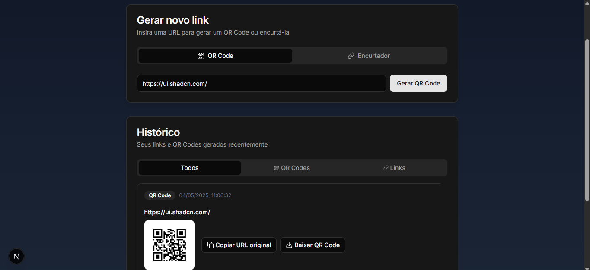

# Gerador de QR Code & Encurtador de Links

Este é um projeto web que permite gerar códigos QR a partir de URLs e também encurtar links longos de forma fácil e rápida.

## Funcionalidades

- **Gerar QR Code:** Insira uma URL e gere instantaneamente um código QR correspondente. Você poderá utilizar este código para compartilhar links facilmente através de dispositivos móveis.
- **Encurtar Links:** Cole uma URL longa e obtenha um link mais curto e amigável para compartilhar em diversas plataformas.
- **Histórico:** A aplicação mantém um histórico dos seus links e códigos QR gerados recentemente, facilitando o acesso e a reutilização.

## Tecnologias Utilizadas

Este projeto foi construído utilizando as seguintes tecnologias:

- **Next.js:** Um framework React para desenvolvimento web com recursos como renderização do lado do servidor (SSR) e roteamento fácil. (Versão: 15.3.1)
- **React:** Uma biblioteca JavaScript para construir a interface de usuário interativa. (Versão: ^19.0.0)
- **react-dom:** A porta de entrada para a DOM e APIs de renderização do lado do servidor ou cliente para seus componentes React. (Versão: ^19.0.0)
- **@radix-ui/react-scroll-area:** Um componente para renderizar áreas de conteúdo roláveis com funcionalidades avançadas. (Versão: ^1.2.6)
- **@radix-ui/react-slot:** Um mecanismo para passar elementos filhos para componentes React de forma flexível. (Versão: ^1.2.0)
- **@radix-ui/react-tabs:** Um conjunto de componentes para construir interfaces de navegação por abas acessíveis. (Versão: ^1.1.9)
- **class-variance-authority:** Uma biblioteca para criar variações de classe condicionais com Tailwind CSS. (Versão: ^0.7.1)
- **clsx:** Uma pequena e útil biblioteca para construir strings de classe dinamicamente. (Versão: ^2.1.1)
- **lucide-react:** Uma biblioteca de ícones bonitos e consistentes para React. (Versão: ^0.507.0)
- **next-themes:** Uma maneira fácil de adicionar e alternar temas escuros e claros em aplicativos Next.js. (Versão: ^0.4.6)
- **qrcode.react:** Uma biblioteca React para gerar códigos QR. (Versão: ^4.2.0)
- **sonner:** Uma biblioteca para notificações e toasts elegantes. (Versão: ^2.0.3)
- **tailwind-merge:** Uma função para mesclar classes Tailwind CSS sem conflitos. (Versão: ^3.2.0)

## Como Usar

1.  **Acessar a página:** Abra o link da aplicação no seu navegador.
2.  **Gerar QR Code:**
    - Clique na aba "QR Code".
    - Insira a URL desejada no campo fornecido.
    - Clique no botão "Gerar QR Code".
    - O código QR será exibido e você poderá salvá-lo ou compartilhá-lo.
3.  **Encurtar Link:**
    - Clique na aba "Encurtador".
    - Insira a URL longa no campo fornecido.
    - Clique no botão "Encurtar".
    - O link encurtado será gerado e exibido para você copiar.
4.  **Histórico:**
    - Na seção "Histórico", você poderá ver uma lista dos seus links e códigos QR gerados recentemente.
    - Use as abas "Todos", "QR Codes" e "Links" para filtrar o histórico.

Este projeto visa simplificar o compartilhamento de links, seja através da praticidade de um código QR ou da conveniência de um link curto.